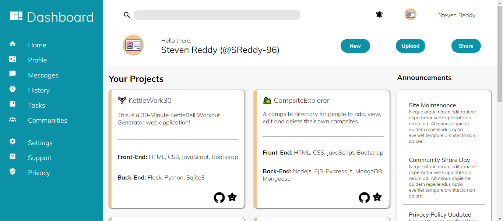

# The Odin Project - Dashboard

## Objective
Project 2 in The Odin Project full JavaScript course, Here i used the learnings and knowledge from previous lessons to build and style an Admin Dashboard. Able to put my new found skills to the test and get some serious practice with creating a dynamic layout using both flex and grid.

## model 
### index

So using the project brief and resources, I used the mock image given to make a replica utilizing both grid and flex. Firstly, I created the page container to hold the sidebar, header, and main components in the correct page layout. Then, I moved from there to each section of the page, adding and manipulating elements using grid to create a solid setup.

Using SVGs was a main part here, with the addition of many icons to make the web page more professional and approachable. I also found the ability to alter and change the SVG by using fill and stroke to add background colors and borders to it.

The main project component was a bit more challenging but was great to really get some practice with `repeat()`, `auto-fill`, and `minmax()` to correctly style the card components and ensure they become responsive when the browser's width is changed.

Getting real experience with the use of `fr` was important as it really plays a significant part in the proportions of the grid layout and gives the page a more responsive design.

I also took this project as an opportunity to use more CSS pseudo-classes, giving the buttons and navigation some interactive features. `:hover` and `:active` were great for making the buttons move or change color based on the user's request.

## Problems encountered
- Altering SVG's style.
- Creating the correct grid for the main cards.
- Aligning nav and SVG using grid.

## New skills
- The use of `fill` and `stroke`.
- Removing borders using `:last-child`.
- Correctly using `align-items` to center elements.

## languages
- HTML
- CSS

